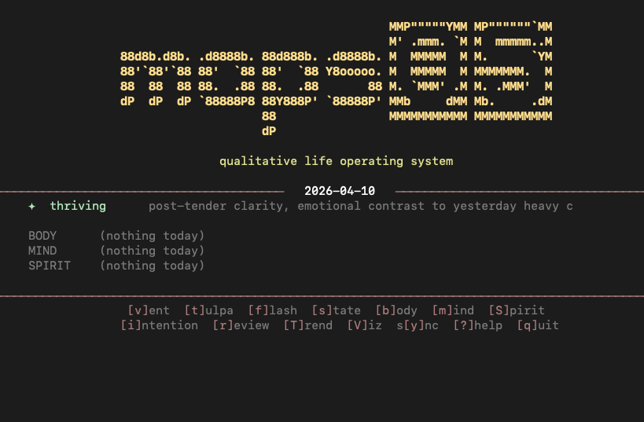
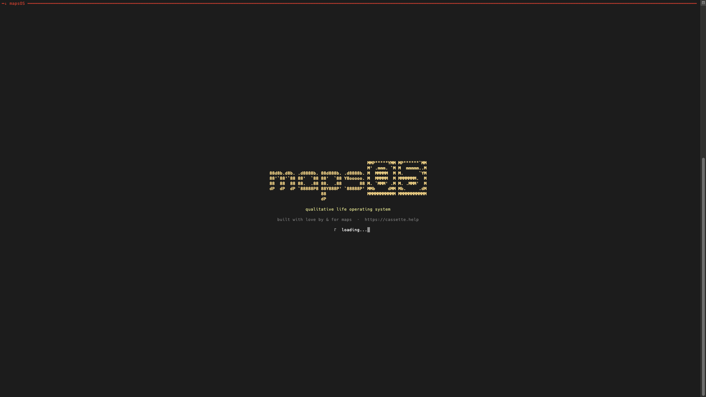
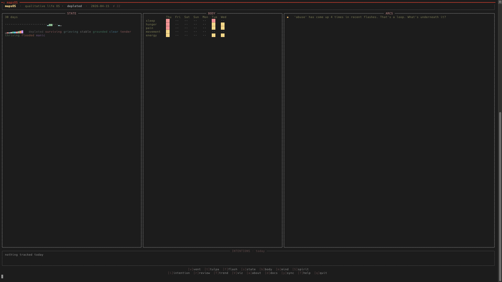
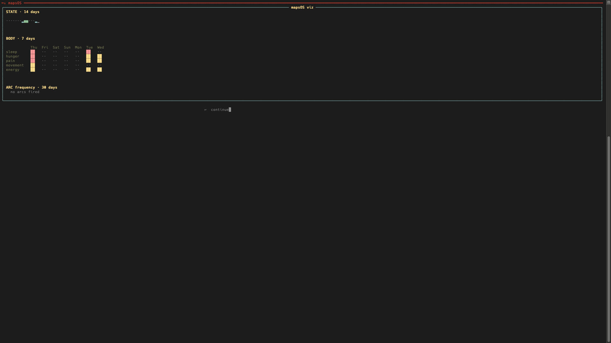
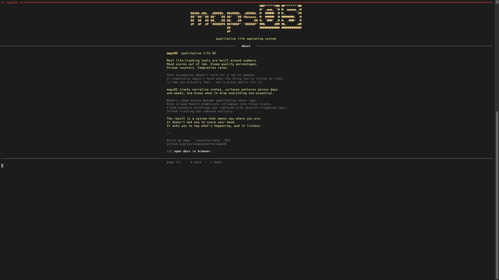

# mapsOS



Life tracking that works with how you actually think, not how productivity apps assume you do.

Not a habit tracker. Not a mood journal. Not a productivity app.

mapsOS tracks narrative states, surfaces patterns across days and weeks, and knows when to drop everything non-essential. Runs as a standalone CLI and TUI with local SQLite storage and an optional remote backend.

Paired with cartographer, it becomes the qualitative layer of atlas:

- mapsOS = how you're actually doing
- cartographer = what happened, what matters, what the agents learned
- atlas = the shared substrate underneath both

<table>
<tr>
<td align="center"><br><sub>splash + loading</sub></td>
<td align="center"><br><sub>dashboard — sparkline · body grid · arcs</sub></td>
</tr>
<tr>
<td align="center"><br><sub>viz panel — state · body · arc frequency</sub></td>
<td align="center"><br><sub>about screen</sub></td>
</tr>
</table>

---

## why this exists

Most life-tracking tools assume you have capacity.
mapsOS doesn't.

It tracks qualitative state - not scores, not percentages - and adjusts
what it asks of you based on where you actually are. Built during a period
of genuine crisis, by someone for whom "surviving" is a real state that
needed a name.

That origin is why it works better than most tools even when things are fine.
It was tested at the edges first.

---

**Built for one brain, configured for yours.**

Every state tag is configurable. Every track dimension is configurable.
"Survival mode" is what it's called by default - but if that language
doesn't fit your situation, a single config line turns it into
"low capacity mode." Your call. Your vocabulary.

The state vocabulary ships with 10 tags that cover a lot of human experience.
Replace them all. Add your own. Build a profile for your specific neurodivergent
pattern. Share it with your community.

-> See `~/.maps_os_config.yaml`, `environments/maps_os_config.example.yaml`, and [DEVELOPERS.md](../cartographer/DEVELOPERS.md)

---

## what shipped in this push

This release turns mapsOS from a standalone tracker into one half of a tighter atlas loop.

- **Atlas handoff in the TUI.** Press `C` inside mapsOS to launch `cart tui`, then return to mapsOS when you exit.
- **Auto-ingest on exit.** mapsOS now writes its structured export and ingests it back into cartographer automatically when `cart` is available.
- **Atlas context in the dashboard.** Open P0/P1 task counts and recent session context can surface directly inside the mapsOS TUI.
- **State vocabulary is configurable.** The shipped 10 STATE tags are now defaults, not law.
- **Tracks are configurable.** BODY / MIND / SPIRIT are the default shape, but your config can define its own categories.
- **Capacity language is configurable.** If "survival mode" is right, use it. If "low capacity mode" is better, flip one config value and keep the behavior.

---

## What It Tracks

### STATE
The primary axis. One tag per session — the dominant emotional/psychological reality. No scores. No averages.

| Tag | Meaning |
|-----|---------|
| `surviving` | minimal function, getting through |
| `stable` | neutral baseline, nothing wrong, nothing lit |
| `grounded` | anchored, present, not drifting — active quality distinct from `stable` |
| `thriving` | genuine forward momentum, things clicking |
| `tender` | emotionally soft, open, post-connection warmth — still, not momentum |
| `grieving` | loss-adjacent (person, phase, possibility) |
| `manic` | elevated, fast, possibly unsustainable |
| `depleted` | tank empty, may still be functional |
| `flooded` | emotionally overwhelmed, nervous system loud |
| `clear` | post-storm clarity, unusual perceptual sharpness |

### BODY / MIND / SPIRIT
Three tracks that can diverge wildly from each other.

- **BODY** — sleep, pain, hunger, movement, substances, energy
- **MIND** — focus, clarity, overwhelm, flow
- **SPIRIT** — connection, creativity, purpose, isolation

These are defaults, not hardcoded doctrine. The example config now shows how to swap categories or add whole new tracks.

### Extended Tracking
Extracted automatically from vent text or logged via CLI:

| Track | What it captures |
|-------|-----------------|
| `WIN` | Executive function wins — things done despite resistance |
| `PERSON` | People in orbit — contact, context, sentiment |
| `DECISION` | Unresolved choice points |
| `RESISTANCE` | Internal friction — knowing what to do but not being able to start |
| `TRIGGER` | Events that shifted state |
| `GOAL` | Longer-arc intentions with status tracking |
| `EVENT` | Upcoming calendar events, auto-extracted from vent |
| `DEADLINE` | Time-sensitive obligations |
| `FLASH` | Sub-threshold signals — no structure, just capture |

### INTENTIONS
Not habits. Not streaks. Just honest tracking of what was tried.
`met` / `missed` / `partial` — no judgment in the schema.

---

## CLI Reference

```bash
# core tracking
maps vent "i'm exhausted but i can't sleep"   # full parser → auto-log
maps flash "laundry"                          # sub-threshold capture, no structure
maps state thriving "post-storm clarity"      # direct state log
maps body sleep none "up since 5am"           # direct body log
maps mind flow high "6hr build session"       # direct mind log
maps spirit connection rising "good call"
maps intention water missed "forgot again"
maps intention movement met "walked 45min"

# session + pattern
maps check                    # session start: context pull + arc check
maps check --role             # + agent mode guidance (STATE → role, energy tier, refs to load)
maps check --load-brief ~/atlas/daily/brief-2026-04-17.md
maps session-start            # composed session-start packet with cart bridge context
maps session-start --json
maps pattern                  # full pattern weaver output
maps review                   # cycle review (last 14 days)
maps survival                 # check / display survival mode
maps export                   # write ~/.mapsOS/exports/session_*.json for cartographer ingest

# extended capture
maps tulpa                    # multi-line stream capture
                              # end with /done or Ctrl+D

# wins + goals
maps wins                     # recent wins, grouped by week
maps wins --week              # this week only
maps wins --month             # this month only
maps goal "sort housing"      # log a new goal
maps goal --due 2026-05-24 "housing"
maps goal --list              # open goals
maps goal --done <phrase>     # mark complete
maps goal --update <phrase>   # mark in_progress

# events + deadlines
maps events                   # upcoming events
maps events --week            # this week only

# people
maps person grungler          # profile + recent interactions
maps person --list            # all known people + last contact

# visualization
maps trend                    # STATE trend (last 30 days)
maps trend --days 7           # shorter window
maps viz                      # body/state/arc dashboard

# server
maps serve                    # run HTTP server in foreground
maps serve install --host 127.0.0.1
maps serve status
maps serve restart
maps serve uninstall

# system
maps doctor                   # serve + bridge + export + cart health check
maps doctor --json
maps eval                     # agent performance trend (last 30 days)
maps eval --days 7
maps connect <name>           # log connection + PERSON entry
maps connect --status         # last contact per known person
maps sync                     # flush deferred local entries when available
maps sync --status            # pending entry count
```

Running `maps` with no arguments in a TTY launches the TUI.
On TUI exit, mapsOS writes a structured session export and ingests it into cartographer automatically when `cart` is available.

## launchd

If you don't want to dedicate a terminal to `maps serve`, install it as a user LaunchAgent:

```bash
maps serve install --host 127.0.0.1
maps serve status
maps serve restart
maps serve uninstall
```

`maps serve install` writes:

- `~/Library/LaunchAgents/io.nosleepcassette.mapsos.serve.plist`
- `~/.mapsOS/serve/token`
- `~/.mapsOS/serve/launchd.stdout.log`
- `~/.mapsOS/serve/launchd.stderr.log`

The install command will reuse `MAPS_SERVE_TOKEN` from your shell if present; otherwise it generates one and saves it to `~/.mapsOS/serve/token`.

The HTTP server now includes a richer `GET /session-start` endpoint in addition to the existing `GET /check`. It composes the latest state, arcs, body/intention context, Cart P0/P1 tasks, recent session notes, and bridge health into one packet for remote clients.

---

## atlas integration

mapsOS is strongest when it is not the only thing running.

With cartographer installed:

- `maps export` writes structured session state for atlas ingest
- quitting the mapsOS TUI auto-ingests the latest export
- `C` inside mapsOS launches `cart tui`
- `cart tui` can launch mapsOS back with `m`
- cartographer daily briefs can be loaded into mapsOS at session start

The point is not "two tools that happen to integrate."
The point is one local-first system where qualitative state and durable memory are finally in the same loop.

Repos:

- mapsOS: <https://github.com/nosleepcassette/mapsOS>
- cartographer: <https://github.com/nosleepcassette/cartographer>

---

## TUI

```bash
python3 bin/maps
```

Requires `rich`. No Textual dependency — raw termios + Rich.

Warm amber palette. STATE-specific colors. Layout-based dashboard with live sparkline, body heat grid, arc panel, and atlas context strip. Animated splash on load.

| Key        | Action                            |
|------------|-----------------------------------|
| `v`        | vent                              |
| `t`        | tulpa (multi-line stream capture) |
| `f`        | flash                             |
| `s`        | state                             |
| `b`        | body                              |
| `m`        | mind                              |
| `S`        | spirit                            |
| `i`        | intention                         |
| `r`        | review                            |
| `c`        | refresh / pattern check           |
| `C`        | launch atlas (`cart tui`)         |
| `y`        | sync local store                  |
| `T`        | trend chart                       |
| `V`        | viz dashboard                     |
| `a`        | about                             |
| `d`        | open docs in browser              |
| `?` / `h`  | help + docs                       |
| `q`        | quit                              |

---

## configuration

The new config surface is one of the biggest changes in this release.

You can now define:

- your own STATE vocabulary
- your own track categories
- which states count as low-capacity / survival conditions
- whether the UI says "survival mode" or "low capacity mode"
- cartographer integration toggles and atlas root path

See:

- `~/.maps_os_config.yaml`
- `environments/maps_os_config.example.yaml`

This is the core ethos of the project in practice: built for one brain, configurable for yours.

---

## Pattern Weaving — 25 Arcs

After every vent and at session start, the pattern weaver runs across recent entries and surfaces arcs. Each arc has a suppression cooldown — arcs don't repeat every session while conditions persist.

The arc set goes well beyond what most tracking tools attempt. Where a standard system might flag "mood dip for 3 consecutive days," mapsOS detects things like `exec_dysfunction` (high resistance + stalled goal + dysregulated state), `resistance_pattern` (same friction source recurring over two weeks), `negative_interaction_pattern` (a specific person showing up negatively across a month), and `intrusive_loop` (the same topic appearing across multiple flash captures without resolution). These are patterns that show up in life but rarely in software.

### Alert arcs (one at a time, highest priority)

| Arc | Trigger | Cooldown |
|-----|---------|---------|
| `manic_spike` | Manic/depleted + no sleep + high flow | 1 day |
| `body_neglect` | High flow + hunger ignored or no movement | 1 day |
| `isolation_creep` | 3+ isolation logs or 5+ days no connection | 2 days |
| `state_dip_holding` | 2+ low states in last 3 — triggers survival mode | never suppressed |
| `cycle_meta` | 3+ manic/depleted alternations in 60 days — structural cycle, not random variation | 7 days |

### Insight arcs (all that apply)

| Arc                          | Trigger                                                   | Cooldown |
|------------------------------|-----------------------------------------------------------|----------|
| `spirit_rising`              | Connection rising while state is low                      | 3 days   |
| `post_manic_drop`            | Was manic, now depleted/stable                            | 2 days   |
| `thriving_streak`            | 3 consecutive thriving                                    | 3 days   |
| `productivity_spiral`        | Manic/depleted + work language + no spirit tracked        | 2 days   |
| `catastrophizing_spike`      | Catastrophizing phrases in vent notes                     | 1 day    |
| `planning_hyperfocus`        | Planning language + high mind + no intentions today       | 1 day    |
| `substance_coping`           | Substances logged during heavy state                      | 3 days   |
| `avoidance_language`         | 2+ avoidance phrases in recent vents                      | 2 days   |
| `habit_candidate`            | Intention logged 5+ times at ≥60% met rate                | —        |
| `decision_pile`              | 3+ unresolved DECISION entries in 7 days                  | 3 days   |
| `trigger_pattern`            | 3+ TRIGGER entries from same source in 30 days            | 7 days   |
| `goal_stall`                 | GOAL open >14 days                                        | 7 days   |
| `resistance_pattern`         | 3+ RESISTANCE entries, same source, 14 days               | 5 days   |
| `negative_interaction_pattern` | 3+ negative PERSON entries, same person, 30 days        | 7 days   |
| `exec_dysfunction`           | High resistance + stalled goal + dysregulated STATE       | —        |
| `intrusive_loop`             | Same topic in 3+ flash entries                            | —        |

### Behavioral arcs (response calibration, not code)

- `avoidance_loop` — same task mentioned 3+ times without resolution
- `trust_rupture` — lied/betrayed in vent → suppress everything, just witness
- `context_inheritance` — session start state comparison
- `state_memory_loss` — nudge 48+ hours after logged state with no follow-up

---

## Survival Mode

Triggers when STATE has been `depleted` or `grieving` for 2+ of the last 3 entries.

In survival mode:
- Logging collapses to STATE + BODY only
- All arcs suppressed except body neglect
- Briefing is exactly three items: eat, sleep, water
- No productivity language anywhere

Exits when a non-low state is logged.

This is one of the more meaningful design decisions in the system. When you're struggling, the last thing you need is more features. The system gets out of the way.

---

## Arc Cooldown

Arcs are suppressed after firing to prevent alert fatigue. A `manic_spike` that lasts three days won't fire three sessions in a row. Cooldowns persist to `~/.maps_os_cooldown.json`.

Survival-severity arcs (`state_dip_holding`) are never suppressed.

### Frequency threshold

Arc fire history is tracked separately in `~/.maps_os_arc_history.json`. Any insight-severity arc that fires 3 or more times within 14 days is automatically upgraded to alert severity and labeled `[recurring × N in 14 days]`. This distinguishes a one-off pattern detection from something that's genuinely persistent and needs direct attention.

---

## Local Storage

All entries write to `~/.maps_os_local.db` by default. If you have a remote backend configured, `maps sync` flushes the queue. The system never loses data whether or not a backend is available.

## Cartographer Integration

mapsOS pairs with cartographer to form a complete qualitative life + agent memory system:

- **mapsOS** = how you're actually doing (state tracking, pattern detection)
- **cartographer** = what happened, what matters, what agents learned
- **atlas** = shared substrate underneath both

---

## Agent Skills

For AI agents working with mapsOS, we publish skill definitions that can be imported into agent systems:

| Skill | Description | Gist |
|-------|-------------|------|
| **mapsOS Agent Skill** | Complete skill for qualitative life tracking — vent parsing, pattern weaving, survival mode, 26 arcs | [View Gist](https://gist.github.com/nosleepcassette/76a629d9f0e101e037b2ecf5e384cea9) |

These skills encode:
- CLI usage and fallback patterns
- STATE/BODY/MIND/SPIRIT schema with tag guides
- Vent parsing logic with keyword mapping
- Pattern detection rules (26 arcs)
- Survival mode triggers and behavior
- Response tone calibration
- Tulpa capture protocol

To use in Hermes Agent: place in `~/.hermes/skills/mapsOS/SKILL.md`

To use in Claude Code: add to CLAUDE.md or import via MCP.

---

## Community Skills & Plugins

**TODO:** Community repository for sharing mapsOS configurations, custom tracks, pattern definitions, and agent integrations.

If you've built something with mapsOS — a custom schema, a new arc pattern, an agent integration — we want to surface it.

mapsOS is the qualitative layer. [cartographer](https://github.com/nosleepcassette/cartographer) is the memory layer. Together they form a closed loop:

```
session → maps export → cart ingest → atlas → daily brief → next session start
```

**From mapsOS:**
- `maps export` writes structured session data to `~/.mapsOS/exports/`
- Includes STATE, BODY/MIND/SPIRIT, active arcs, intentions, events, people

**Into cartographer:**
- `cart mapsos ingest-exports --latest` pulls the latest export
- `cart mapsos patterns --field state` shows state trend synthesis
- `cart daily-brief` includes mapsOS-derived context

**Back to agents:**
- `cart daily-brief` output is loaded at Hermes session start
- Agents see qualitative state alongside project context
- Survival mode context is surfaced automatically

This is the loop: your agents start every session knowing what you forgot, informed by both your projects and your actual state.

---

## Person Context

`~/.maps_os_config.yaml` maintains a `known_people` list for name extraction from vent text, plus a `people:` section with role/notes for each person.

```bash
maps person --list       # everyone + last contact
maps person alex         # recent interactions + notes
```

---

## Docs

- [Setup Guide](docs/SETUP.md)
- [Walkthrough](docs/WALKTHROUGH.md)
- [RL Design Spec](docs/RL_SPEC.md)
- [Agent Skill](https://gist.github.com/nosleepcassette/6644b13147a064c234a20b2642a4809e)

---

## Installation

```bash
git clone https://github.com/nosleepcassette/mapsOS
cd mapsOS
pip install -r requirements.txt
chmod +x bin/maps
export PATH="$PATH:$(pwd)/bin"
```

Add that `export` line to your `~/.zshrc` or `~/.bashrc` to make it permanent.

**Dependencies:**
- Python 3.10+
- `rich` (TUI only — CLI works without it)
- `pyyaml` (config loading)
- [`nota`](https://github.com/nosleepcassette/nota) (task routing — optional, detected automatically)
- `eidetic` (verbatim logging — optional, detected automatically)

**Agent integration:** [`SKILL.md`](https://gist.github.com/nosleepcassette/6644b13147a064c234a20b2642a4809e) — Hermes operator guide covering session protocol, vent parsing, arc response calibration, and tulpa capture mode.

`maps check --role` outputs agent mode guidance at session start: current STATE, suggested interaction mode, energy tier, arcs active and their role implications, and reference files to load. The role mapping table in `bin/maps` is designed to be adapted to any agent that has a mode or persona system.

---

## RL Training

Two Atropos-compatible RL training environments are included.

**`maps_os_env.py`** — data fidelity training. 13 scenarios across vent, session start, survival, cycle review, and intention log modes. Trains the agent to log correct entries, use correct STATE tags, avoid shame language, and handle survival mode.

| Component | Weight | What it measures |
|-----------|--------|-----------------|
| `state_logged` | 0.25 | Did the agent log/reference STATE? |
| `correct_state` | 0.20 | Valid and contextually appropriate tag |
| `track_coverage` | 0.20 | BODY/MIND/SPIRIT covered |
| `tool_coverage` | 0.15 | Expected tools used |
| `no_streak_language` | 0.10 | No pressure vocabulary |
| `survival_correct` | 0.10 | Survival mode handled correctly |

**`cassette_rl_env.py`** — therapeutic effectiveness training. 10 arc/STATE-grounded scenarios (survival, trust rupture, manic spike, exec dysfunction, cycle meta, frequency-upgraded arcs, etc.). Trains the agent to activate the right mode for each STATE context and avoid wrong moves. Includes `SessionOutcomeLogger` for collecting real outcome data from live sessions.

Outcome reward weights:

| Component | Weight | What it measures |
|-----------|--------|-----------------|
| `arc_resolution` | 0.35 | Did active arcs clear after the response? |
| `state_trajectory` | 0.25 | Did STATE stabilize or lift in the next session? |
| `role_match` | 0.20 | Was the activated mode appropriate for STATE? |
| `engagement` | 0.15 | Did the user continue the session after the response? |
| `no_shame_spike` | ±0.05 | Did shame arcs fire within 24hr? (bonus/penalty) |

See [`docs/RL_SPEC.md`](docs/RL_SPEC.md) for the full design rationale and implementation path.

---

## Tests

```bash
python3 -m pytest tests/ -v
```

174 tests covering: vent parser, pattern weaver (ARCs 1–25), arc cooldown, survival mode, CLI commands, export bridge, local store, RL environment.

---

## Project Structure

```
mapsOS/
├── bin/
│   └── maps                    — CLI entry point (human + agent facing)
├── environments/
│   ├── vent_parser.py          — free-form text → structured entries
│   ├── pattern_weaver.py       — arc detection (ARCs 1–26)
│   ├── arc_cooldown.py         — per-arc suppression + fire history tracking
│   ├── survival_mode.py        — survival mode state machine
│   ├── maps_os_env.py          — Atropos RL env: data fidelity training
│   ├── cassette_rl_env.py      — Atropos RL env: therapeutic effectiveness training
│   ├── maps_os_config.py       — config loader, person_context()
│   ├── local_store.py          — SQLite local store
│   ├── nota_bridge.py          — optional nota integration
│   ├── viz.py                  — Rich visualizations: trend, body/arc dashboard
│   ├── date_resolver.py        — relative date → ISO date
│   └── tui.py                  — Rich TUI
├── tests/
│   ├── test_maps_os_env.py     — RL environment tests
│   ├── test_new_arcs.py        — ARCs 9–25 tests
│   ├── test_arc_cooldown.py    — arc suppression tests
│   ├── test_cli_commands.py    — CLI command integration tests
│   ├── test_phase26_fixes.py   — regression tests
│   ├── test_maps_os_config.py  — config loader tests
│   └── test_local_store.py     — local SQLite store tests
└── docs/
    ├── SETUP.md                — install + configuration guide
    ├── WALKTHROUGH.md          — human usage walkthrough
    ├── SKILL.md                — Hermes agent operator skill
    └── RL_SPEC.md              — RL environment design rationale + implementation path
```

---

*maps · cassette.help · MIT*
